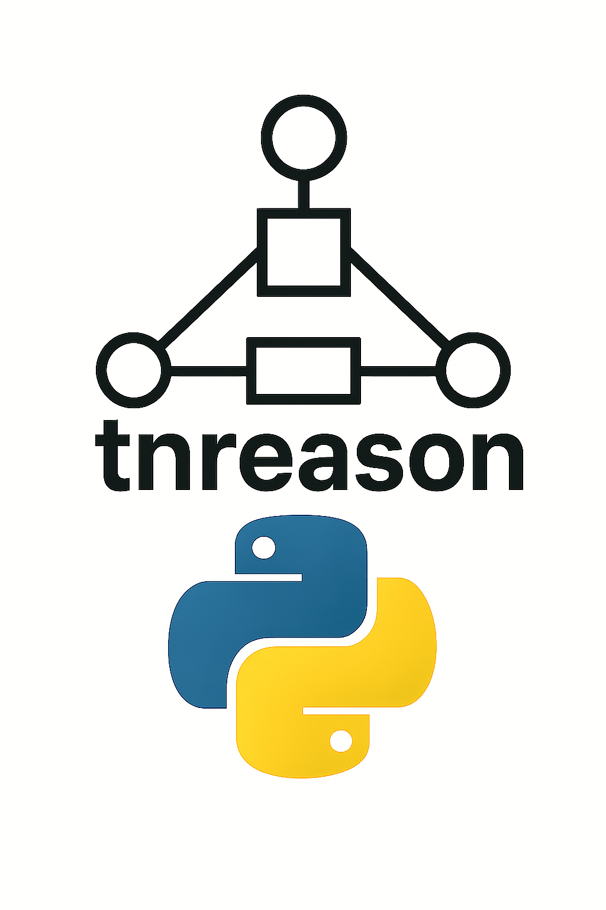
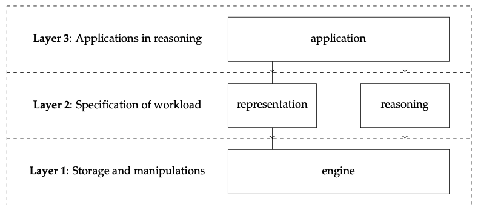

# tnreason



A package for efficient and explainable reasoning based on Tensor Network algorithms.

## Installation

```bash
pip install tnreason
```

## Application Examples

- Hybrid Logic and Probabilistic Reasoning [Accounting Example](https://github.com/EnexaProject/enexa-tensor-reasoning/tree/version1/examples/accounting)

- Statistical models of Knowledge Graphs [DBpedia Example](https://github.com/EnexaProject/enexa-tensor-reasoning/tree/version1/examples/dbpedia_companies)

- Solution of Constraint Satisfaction Problems [Sudoku Example](https://github.com/EnexaProject/enexa-tensor-reasoning/tree/version1/examples/sudoku)

## Architecture



## References

Demonstrations can be found here in the [Colab tutorials](https://drive.google.com/drive/folders/1JeHH8haomh3fhtXY1KQYvF6iKZRDRCqG?usp=share_link).

A mathematical documentation can be found at the [research notes repository](https://github.com/EnexaProject/enexa-tensor-reasoning-documentation).